## NAMA  : NIA DWI RAHAYU
## KELAS : TI.20.A2
## NIM   : 312010298

## Pertemuan 9

## Lab7Web 

Di pertemuan kali ini kita akan mempelajari **PHP DASAR** dengan beberapa program code ***PHP*** nya.

## PHP DASAR
## LANGKAH - LANGKAH PRAKTIKUM
## 1). SIAPKAN XAMPP YANG SUDAH DI INSTAL UNTUK SERVER
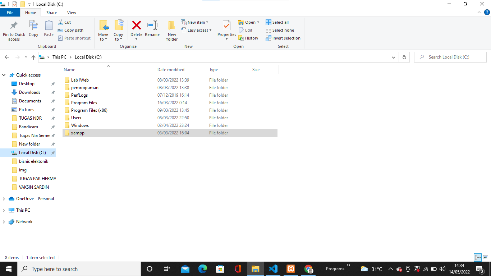

## 2) MENJALANKAN WEB SERVER
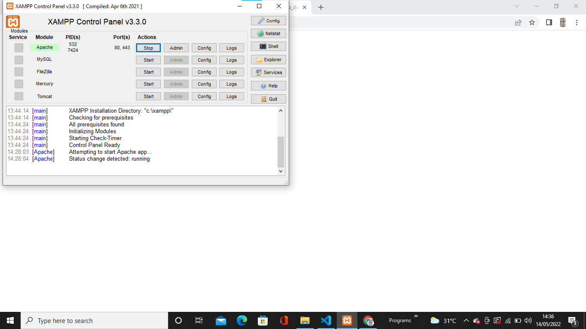
**PENJELASAN**

Mengaktifkan **XAMPP** dengan menekan tombol START **SERVER APACHE** Seperti gambar di atas

## 3) MEMULAI PHP
Buat folder lab7_php_dasar pada root directory web server(c:xampp\htdocs)
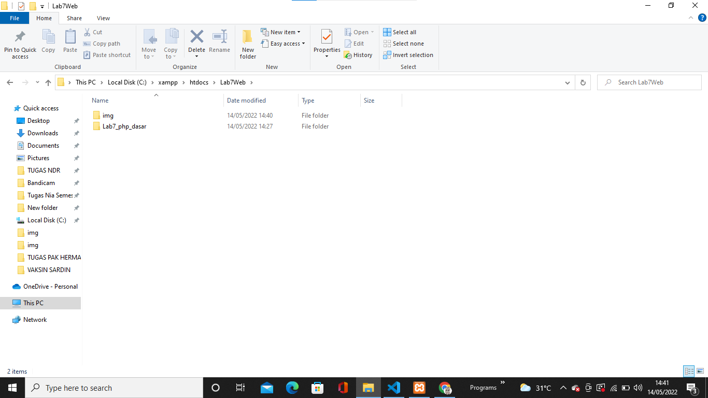

**PENJELASAN**

Di atas saya membuat folder ***lab7_php_dasar*** yang dimana folder itu disimpan dalam folder **Lab7Web** untuk repository

Kemudian akses directory pada web server dengan mengakses URL: http://localhost/Lab7Web/Lab7_php_dasar/
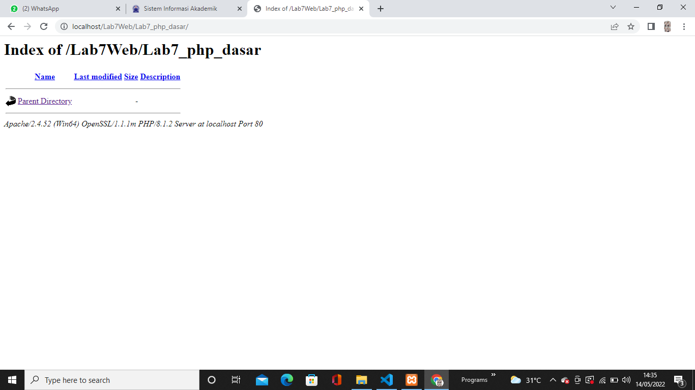

**PENJELASAN**

Di atas adalah contoh dari tampilan dalam URl atau tampilan server folder tersebut.

## 4) PHP DASAR
Buat File baru dengan nama **php_dasar.php** pada directory tersebut kemudian buat kode seperti berikut.
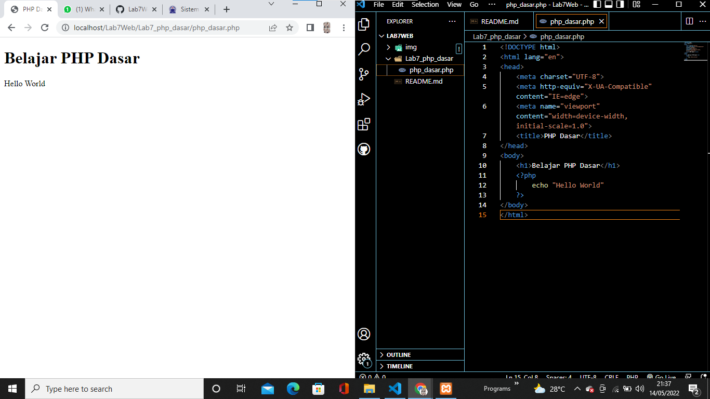

**PENJELASAN**

Kemudian akses URL untuk hasil nya : http://localhost/Lab7Web/lab7_php_dasar/php_dasar.php

Di atas adalah contoh hasil dari penggunaan **PHP** dalam file html atau **embed**
```Code php
<!DOCTYPE html>
<html lang="en">
<head>
    <meta charset="UTF-8">
    <meta http-equiv="X-UA-Compatible" content="IE=edge">
    <meta name="viewport" content="width=device-width, initial-scale=1.0">
    <title>PHP Dasar</title>
</head>
<body>
    <h1>Belajar PHP Dasar</h1>
    <?php
        echo "Hello World";
    ?>
</body>
</html>
```
## 5) VARIABLE PHP
Menambahkan Variable pada program
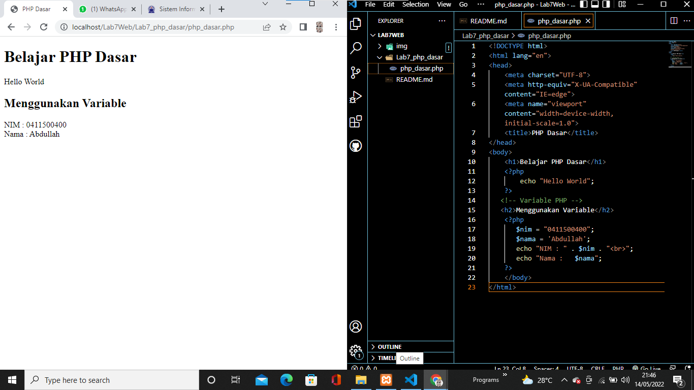

**PENJELASAN**

Di atas adalah contoh penggunaan Variable di **PHP**
```code php
<h2>Menggunakan Variable</h2>
    <?php
       $nim = "0411500400";
       $nama = 'Abdullah';
       echo "NIM : " . $nim . "<br>";
       echo "Nama : $nama"; 
    ?>
```
## 6). PREDEFINE VARIABLE $_GET
Menggunakan **Predefine Variable**
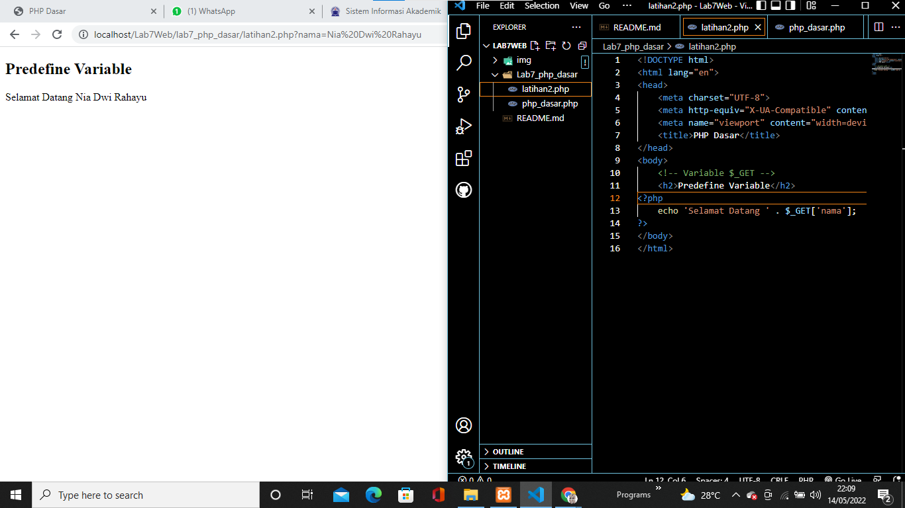

**PENJELASAN**

Buat File baru dalam directory **lab7_php_dasar** dengan nama file nya adalah **latihan2.php** dan buat code seperti dibawah dan untuk mengaksesnya gunakan URL: http://localhost/Lab7Web/lab7_php_dasar/latihan2.php?nama=Nia%20Dwi%20Rahayu dan tampilan nya seperti gambar diatas.

```code php
<!DOCTYPE html>
<html lang="en">
<head>
    <meta charset="UTF-8">
    <meta http-equiv="X-UA-Compatible" content="IE=edge">
    <meta name="viewport" content="width=device-width, initial-scale=1.0">
    <title>PHP Dasar</title>
</head>
<body>
    <!-- Variable $_GET -->
    <h2>Predefine Variable</h2>
<?php
    echo 'Selamat Datang ' . $_GET['nama'];
?> 
</body>
</html>
```

## 7) MEMBUAT FORM INPUT
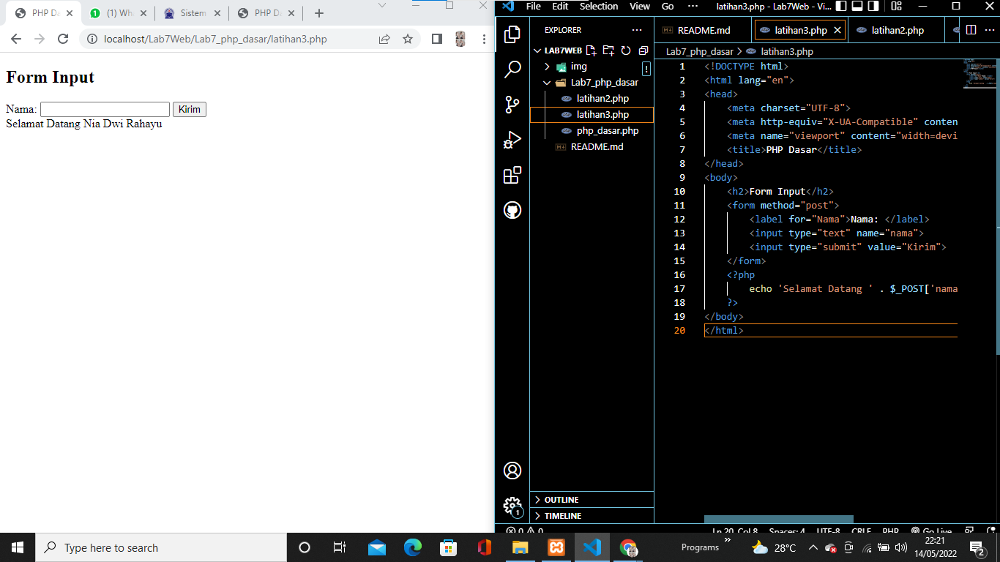

**PENJELASAN**

Buat File baru dengan nama **latihan3.php** dalam directory folder **lab7_php_dasar** di atas adalah hasil atau tampilan dalam membuat ***form*** dalam php dengan variable $_POST contoh code seperti dibawah

```code php
<!DOCTYPE html>
<html lang="en">
<head>
    <meta charset="UTF-8">
    <meta http-equiv="X-UA-Compatible" content="IE=edge">
    <meta name="viewport" content="width=device-width, initial-scale=1.0">
    <title>PHP Dasar</title>
</head>
<body>
    <h2>Form Input</h2>
    <form method="post">
        <label for="Nama">Nama: </label>
        <input type="text" name="nama">
        <input type="submit" value="Kirim">
    </form>
    <?php
        echo 'Selamat Datang ' . $_POST['nama'];
    ?>
</body>
</html>
```
## 8) OPERATOR
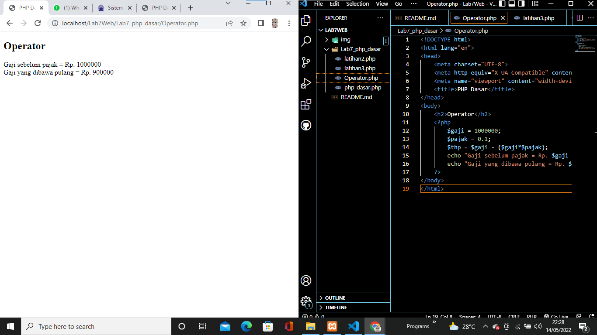

**PENJELASAN**

Membuat **OPERATOR** dalam php seperti contoh hasil tampilan di atas beserta code nya.
```code php
<?php
        $gaji = 1000000;
        $pajak = 0.1;
        $thp = $gaji - ($gaji*$pajak);
        echo "Gaji sebelum pajak = Rp. $gaji <br>";
        echo "Gaji yang dibawa pulang = Rp. $thp";
    ?>
```

## 9) KONDISI IF
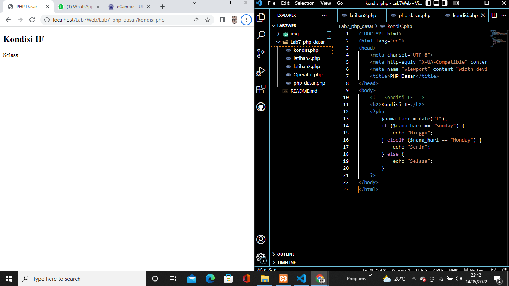

**PENJELASAN**

Pengondisian **IF ELSE** seperti hasil tampilan dan code digambar atas
```code php
<?php
        $nama_hari = date("l");
        if ($nama_hari == "Sunday") {
            echo "Minggu";
        } elseif ($nama_hari == "Monday") {
            echo "Senin";
        } else {
            echo "Selasa";
        }
    ?>
```

## 10) KONDISI SWITCH
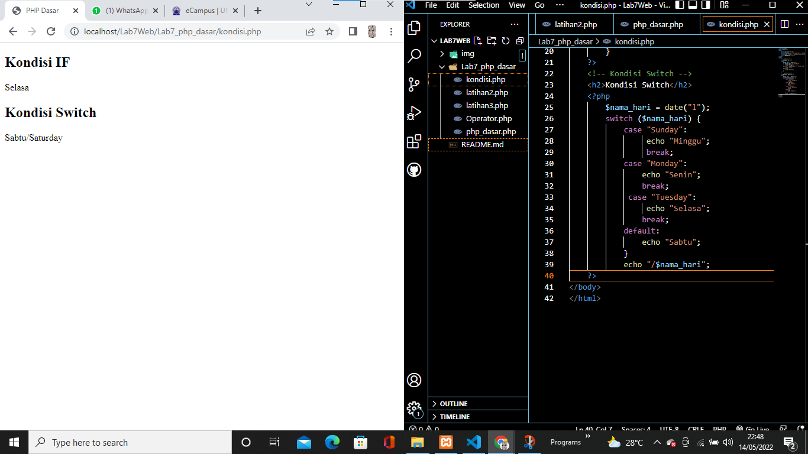

**PENJELASAN**

Contoh penggunaan pengondisian **SWICTH CASE** dengan ***Break*** seperti contoh hasil diatas beserta code.
```code php
<?php
        $nama_hari = date("l");
        switch ($nama_hari) {
            case "Sunday":
                 echo "Minggu";
                 break;
            case "Monday":
                echo "Senin";
                break;
             case "Tuesday":
                 echo "Selasa";
                break;
            default:
                echo "Sabtu"; 
            }
            echo "/$nama_hari";
    ?>
```

## 11) PERULANGAN FOR
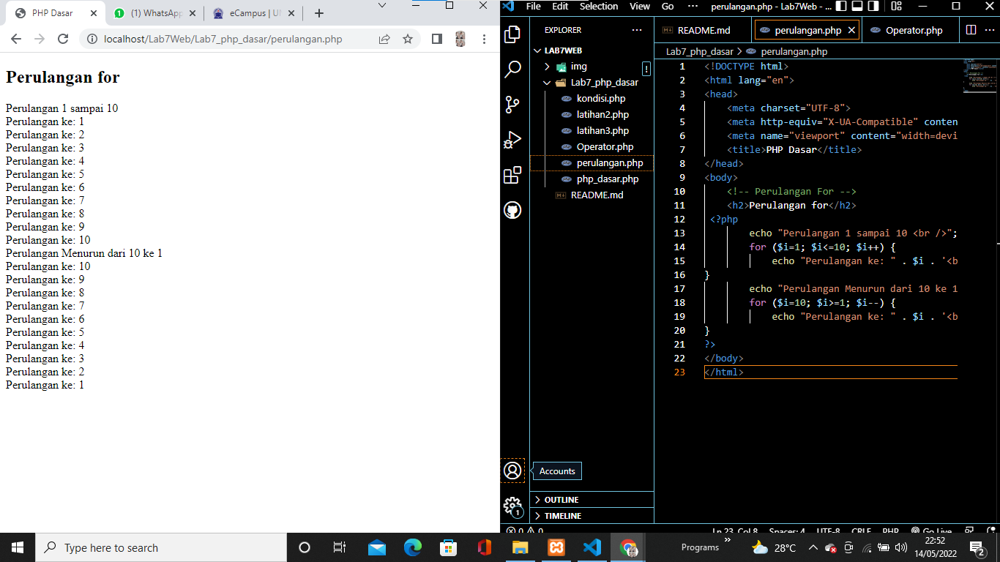

**PENJELASAN**

Menggunakan **PERULANGAN FOR** seperti hasil dan code di atas
```code php
<?php
        echo "Perulangan 1 sampai 10 <br />";
        for ($i=1; $i<=10; $i++) {
            echo "Perulangan ke: " . $i . '<br />';
}
        echo "Perulangan Menurun dari 10 ke 1 <br />";
        for ($i=10; $i>=1; $i--) {
            echo "Perulangan ke: " . $i . '<br />';
}
?>
```
## 12) PERULANGAN WHILE
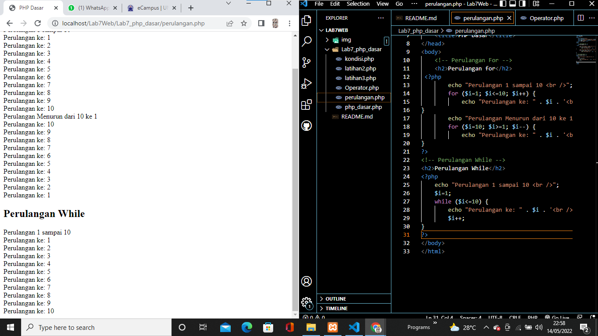

**PENJELASAN**

Menggunakan **PERULANGAN WHILE** seperti hasil gambar dan code di atas.
```code php
<?php
    echo "Perulangan 1 sampai 10 <br />";
    $i=1;
    while ($i<=10) {
        echo "Perulangan ke: " . $i . '<br />';
        $i++;
}
?>  
```
## PERULANGAN DOWHILE
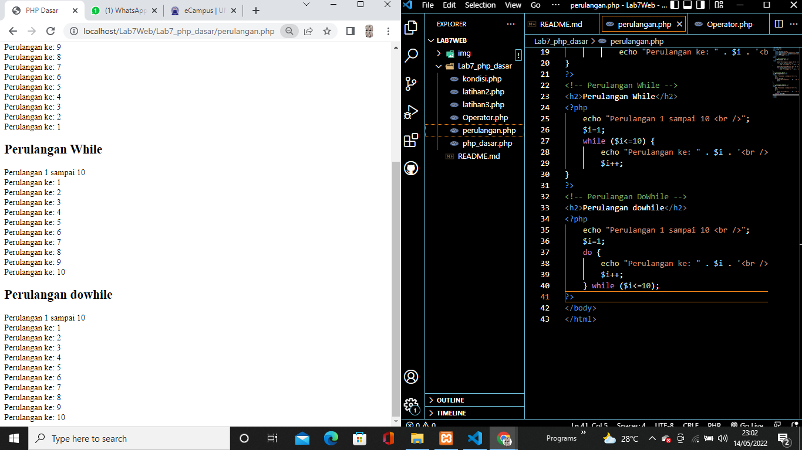

**PENJELASAN**

Menggunakan **PERULANGAN DOWHILE** seperti hasil gambar di atas yg beserta code php nya.
```code php
<?php
    echo "Perulangan 1 sampai 10 <br />";
    $i=1;
    do {
        echo "Perulangan ke: " . $i . '<br />';
        $i++;
    } while ($i<=10);
?>
```